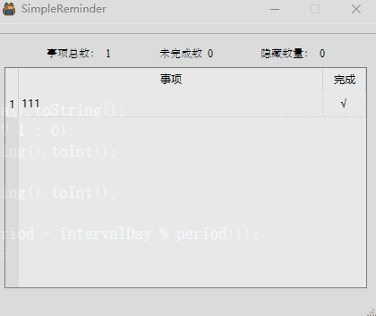
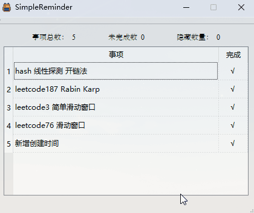
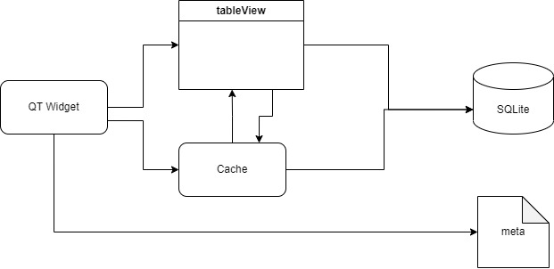

# An extremely simple ToDoList

制作MiniToDoList的初衷是想要一款**极简**的ToDoList。它不需要花里胡哨的功能，只需要记录事务和是否完成等基础信息，配合上一个简单的数据库功能即可。

# 效果

## 基本功能

## 搜索字符串匹配功能

支持按时间或按事项内容字串搜索功能，基于Rabin Karp算法。

## 周期事项功能

可自行体验

# 简单架构

